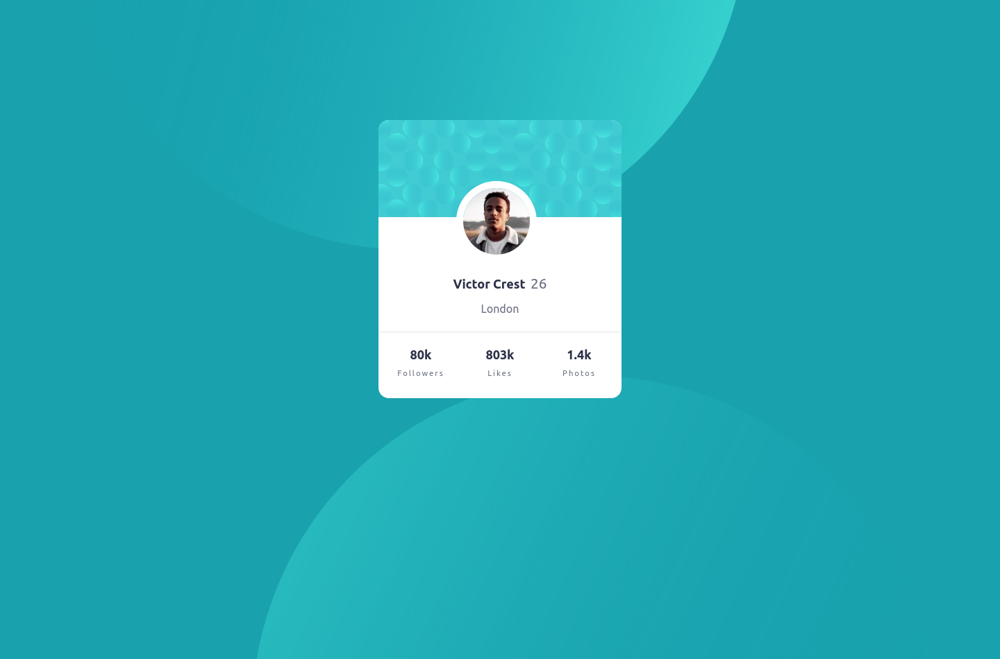

# Frontend Mentor - Profile card component solution

This is a solution to the [Profile card component challenge on Frontend Mentor](https://www.frontendmentor.io/challenges/profile-card-component-cfArpWshJ). Frontend Mentor challenges help you improve your coding skills by building realistic projects. 

## Table of contents

- [Overview](#overview)
  - [The challenge](#the-challenge)
  - [Screenshot](#screenshot)
  - [Links](#links)
- [My process](#my-process)
  - [Built with](#built-with)
  - [Continued development](#continued-development)
- [Author](#author)

**Note: Delete this note and update the table of contents based on what sections you keep.**

## Overview

### The challenge

- Build out the project to the designs provided

### Screenshot

- Desktop View

- Mobile View

### Links

- Solution URL: [Add solution URL here](https://your-solution-url.com)
- Live Site URL: [Add live site URL here](https://your-live-site-url.com)

## My process

### Built with

- Semantic HTML5 markup
- CSS custom properties
- [Boostrap](https://getbootstrap.com/docs/5.2/getting-started/introduction/) - Boostrap framework

### Continued development

I really hope to get better at web development best practices as well as reponsive design using just CSS

## Author

- Frontend Mentor - [@Julius-Java](https://www.frontendmentor.io/profile/Julius-Java)
- Twitter - [@Julius_Java](https://www.twitter.com/Julius_Java00)
